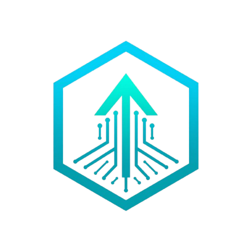
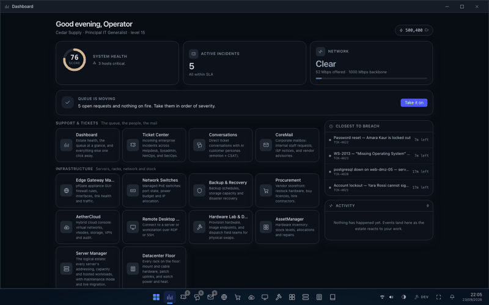
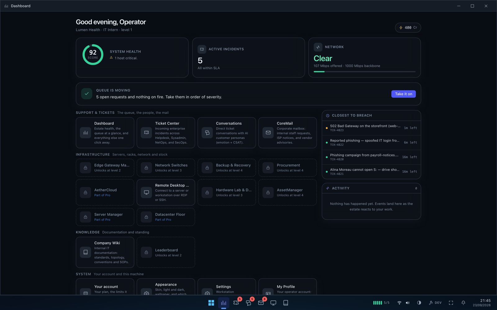
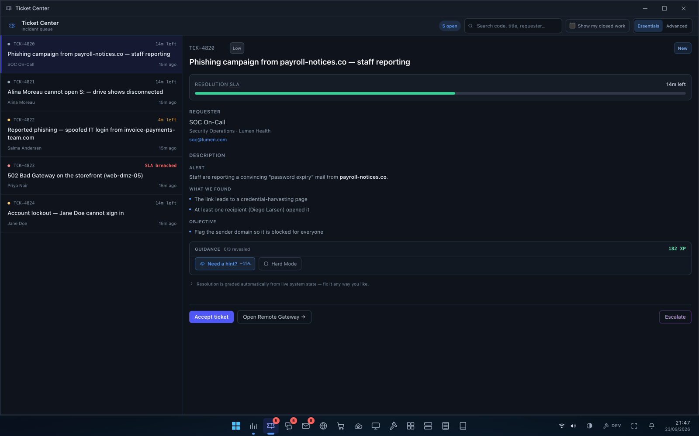
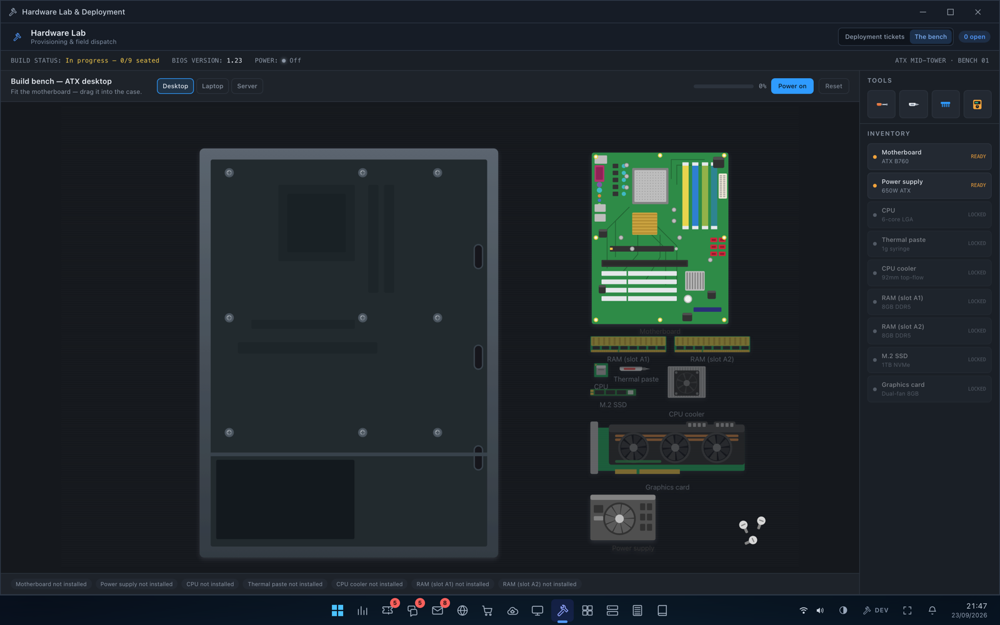
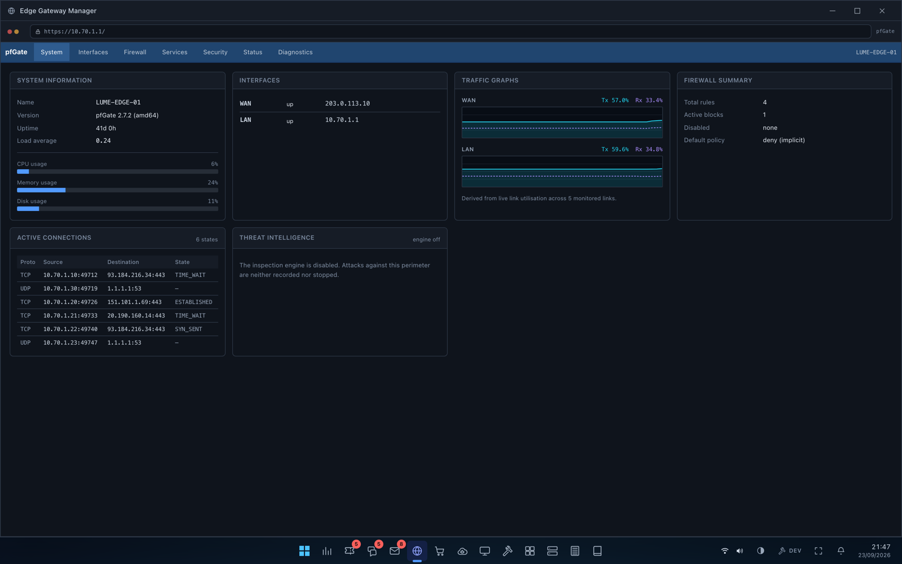
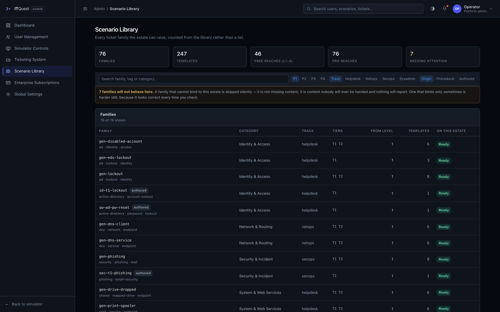
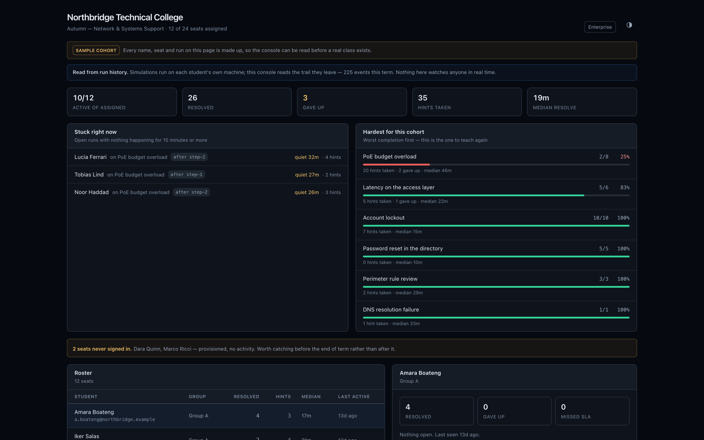

<div align="center">



# ITQuest

**An entire IT department, running in a browser tab.**

A simulation of enterprise IT and cybersecurity work: a nested desktop OS, a live
model of a company's infrastructure, and support tickets that are graded from the
actual state of that infrastructure — not from a checklist.

[](https://c0mrad393.github.io/itquest/)
[](LICENSE)
[](https://nextjs.org)
[](https://www.typescriptlang.org)
[](tests/rack-physics.mjs)
[](#no-backend-no-accounts-no-telemetry)

### [▶ Open the live demo](https://c0mrad393.github.io/itquest/)

No install, no sign-up, no backend. Click **Launch Interactive Lab**, then
**Skip sign-in** — you are in.

</div>

<p align="center">
  
</p>

---

## What this actually is

Most IT training is a video, a quiz, or a scripted lab that checks whether you
typed the expected command. ITQuest is none of those. It runs a **single
authoritative model of a company's estate** — every node, service, firewall rule,
share ACL, directory object, DHCP lease, rack, PDU and backup tier — and it hands
you tickets against it.

There is no "correct path". A ticket is resolved when the **estate is actually
fixed**, whichever way you get there: the GUI, the terminal, the directory
console, or the firewall appliance. The grader reads the world, not your
keystrokes.

```
                 ┌──────────────────────────────────────────┐
  you  ────────► │  DeskOS — the host workstation (Level 0)  │
                 │  tickets · mail · dashboards · consoles   │
                 └────────────────┬─────────────────────────┘
                                  │  RDP / SSH
                 ┌────────────────▼─────────────────────────┐
                 │  a machine inside the estate (Level 1)    │
                 │  Windows: ADUC, services.msc, Event Log   │
                 │  Linux:   a real command interpreter      │
                 └────────────────┬─────────────────────────┘
                                  │  mutates
                 ┌────────────────▼─────────────────────────┐
                 │  InfrastructureState — one shared model   │
                 │  33 → 225 nodes as the company grows      │
                 └────────────────┬─────────────────────────┘
                                  │  read by
                 ┌────────────────▼─────────────────────────┐
                 │  win-conditions · SLA clock · scoring     │
                 └──────────────────────────────────────────┘
```

Fix a stopped service from the Windows GUI or by restarting it over SSH — same
model, same result, same ticket closes.

---

## Screens

<table>
<tr>
<td width="50%"></td>
<td width="50%"></td>
</tr>
<tr>
<td><b>DeskOS</b> — a full windowing shell: taskbar, start menu, snap layouts, themes and skins. Apps unlock as you level up.</td>
<td><b>Ticket Center</b> — live SLA clocks, a hint economy that costs XP, and a note that resolution is graded from system state.</td>
</tr>
<tr>
<td></td>
<td></td>
</tr>
<tr>
<td><b>Hardware bench</b> — build a desktop, laptop or 2U server from parts, in millimetre-accurate geometry. Seat it wrong and it will not POST.</td>
<td><b>Edge gateway</b> — a firewall appliance with its own web UI, in a simulated browser, inside the desktop. Rules, NAT, traffic graphs, threat log.</td>
</tr>
<tr>
<td></td>
<td></td>
</tr>
<tr>
<td><b>Scenario library</b> — the content catalogue, computed from the library itself, reporting which families can actually bind to a given estate.</td>
<td><b>Instructor console</b> — reads the trail a cohort leaves, not their live machines. Who is stuck, which exercise is hardest.</td>
</tr>
</table>

---

## Quick start

The fastest way to see it is the **[live demo](https://c0mrad393.github.io/itquest/)** —
it is the same build, served as a static site.

To run it yourself:

```bash
git clone https://github.com/c0mrad393/itquest.git
cd itquest
npm install
npm run dev
```

Open <http://localhost:3000>, click **Launch Interactive Lab**, then
**Skip sign-in (development)**. That is the whole setup.

| Script | What it does |
|---|---|
| `npm run dev` | Development server |
| `npm run build` | Production build |
| `npm test` | Typecheck **and** the full spec suite |
| `npm run typecheck` | `tsc --noEmit` |
| `npm run test:physics` | 1521 specs over the pure model layer |
| `npm run build:check` | A production build that will not clobber a running dev server |

Requires Node 20+.

### No backend, no accounts, no telemetry

The entire simulation runs client-side. There is no server to stand up, no
database, no API key, no environment file, and nothing is sent anywhere. Your
progress lives in your own browser's `localStorage`. The sign-in screen is part
of the fiction — it is not a security boundary, and it says so on screen.

---

## What is modelled

This is the part that surprises people, so it is worth being concrete. Every item
below is live state that tickets can break and you can repair.

| Domain | What exists |
|---|---|
| **Directory** | Users, groups, OUs, computers, group policy, nested membership, lockout and enablement as separate states |
| **Endpoints** | Windows services, processes, registry, event logs, per-node firewall, mapped drives, filesystem with owner/group/mode, local users |
| **Networking** | Subnets, routes, per-node DNS, IPAM pools and leases, link utilisation and congestion, PoE budgets, VLANs |
| **Perimeter** | Firewall rules, NAT, threat inspection, isolation, traffic graphs |
| **Servers** | Services with dependencies, a real Linux command interpreter (~20 commands, pipes, no shelling out), Windows Update with pause and WSUS policy |
| **Datacentre** | Racks, U positions, cabling, PDUs, power draw, thermals, liquid cooling |
| **Hardware** | Component-level assembly for desktop, laptop and server chassis, with real millimetre geometry and a BIOS/POST sequence |
| **Storage** | Shares, ACLs, quotas, backup schedules and tiers, restore |
| **Cloud** | A small IaaS console: VMs, buckets, routers, VPN, shield rules |
| **People** | Requesters with personas, branching dialogue, an emotion meter and CSAT |

The company also **grows**. Four phases take it from a 35-person startup on one
rack to a 450-person enterprise with 225 nodes, and the estate generated at each
phase is a deterministic function of its seed — so a world is reproducible, and
so is every bug in it.

---

## How a ticket works

A ticket is a small, declarative object. This is the whole contract:

```ts
{
  tags: ["print", "service", "endpoint"],   // decides which app — and level — it needs

  makeContext: (infra, rng) => { … },       // bind to real assets, or null if this
                                            //   estate cannot host the scenario
  injectFault: (draft, ctx) => { … },       // break the world
  win:         (infra, ctx) => boolean,     // read the world; true when it is fixed

  title / description / hints / requester,  // what the human sees
}
```

`win` is the interesting one. It never inspects what you did — only what is now
true. That is what makes multiple solutions work, and it is also what makes the
content testable: the spec suite injects every fault and asserts the ticket is
**not** already solved by it, which catches a whole class of broken scenario.

Two ways to author them:

- **Hand-written** (`lib/tickets/matrix.ts`) — one specific, carefully staged incident.
- **Procedural families** (`lib/tickets/procedural.ts`) — a win-condition archetype
  crossed with variant axes. 76 families currently mint 247 templates.

New scenarios are the easiest and most valuable way to contribute.
**[docs/SCENARIOS.md](docs/SCENARIOS.md)** walks through writing one end to end.

---

## Architecture

| Path | Role |
|---|---|
| `lib/core/` | Canonical domain model — nodes, `InfrastructureState`, tickets, SLA, growth phases |
| `lib/org/` | Deterministic world generator: org profile, topology, directory, fleet |
| `lib/infra/` | The single mutable store every surface writes through |
| `lib/tickets/` | Scenario library — hand-written matrix, procedural families, the factory |
| `lib/vm/` | Sandboxed Linux command interpreter and the Windows Update model |
| `lib/progression/` | Levels, unlocks, skill tracks, operator standing |
| `lib/platform/` | Plans, entitlements, shift allowance — the seam a server could replace |
| `components/host/` | DeskOS: window manager, taskbar, apps |
| `components/host/remote/` | Nested RDP/SSH sessions and per-OS environments |
| `tests/rack-physics.mjs` | 1521 specs, dependency-free, run on bare Node |

Two rules run through the whole codebase, and reading them first will make the
rest make sense:

> **Store what happened, derive what is true.**
> Anything computable is computed on read. Level comes from XP and the plan's
> ceiling; a mapped drive's status comes from the server behind it; a job title
> comes from level and skills. Storing a derived value is how two screens end up
> disagreeing, and most of the bugs this project has had were exactly that.

> **One model, many surfaces.**
> The terminal, the GUI, the appliance and the grader all read and write one
> `InfrastructureState`. If two views can disagree about a fact, that is the bug
> — not a display issue.

More detail in **[docs/ARCHITECTURE.md](docs/ARCHITECTURE.md)**.

---

## Testing

```bash
npm test
```

The suite is deliberately dependency-free: it transpiles the pure model layer
with the project's own TypeScript and runs it on bare Node. No framework, no
runner, no config.

It is also unusual in what it asserts. Alongside ordinary unit tests there are
**properties about the content itself** — that no ticket is solved by its own
injected fault, that every level-1 scenario can bind to a starter estate on every
random seed, that no two entries in a colour map render identically, that endpoint
work is spread across many machines rather than always landing on one. Several of
those exist because the thing they check was broken for months while everything
else passed.

---

## Contributing

Contributions are very welcome, and **new scenarios are the best first
contribution** — they are self-contained, they do not require understanding the
whole codebase, and they are what makes the project more useful to everyone.

- [CONTRIBUTING.md](CONTRIBUTING.md) — setup, conventions, how to propose changes
- [docs/SCENARIOS.md](docs/SCENARIOS.md) — writing a ticket family, start to finish
- [docs/ARCHITECTURE.md](docs/ARCHITECTURE.md) — how the model fits together
- [Good first issues](https://github.com/c0mrad393/itquest/labels/good%20first%20issue)

House style, briefly: no emoji in the product, semantic design tokens rather than
raw colours, and comments that explain **why** rather than what. The existing code
is heavily commented in that style — it is the fastest way to learn the codebase.

---

## Status

This project is **feature-complete as an open-source simulator and no longer
actively developed by its author.** It works, it is tested, and it is released so
that other people can learn from it, teach with it, or take it somewhere new.

Forks are encouraged. If you build something substantial on it, opening an issue
to say so would be genuinely appreciated — it helps others find your work.

There is a pricing page and a plan model in the codebase. They are the remains of
a commercial direction that was abandoned; nothing is billable, no payment code
exists, and the tier system is a client-side pacing mechanism. Treat it as a
worked example of an entitlements seam, or delete it.

---

## Author

**Otari Kharebashvili** — design, architecture and implementation.

Built over 143 commits and roughly 71,000 lines of TypeScript.

## License

[MIT](LICENSE) © 2026 Otari Kharebashvili

Use it, fork it, teach with it, sell what you build on it. Attribution is
required; a mention is appreciated.
